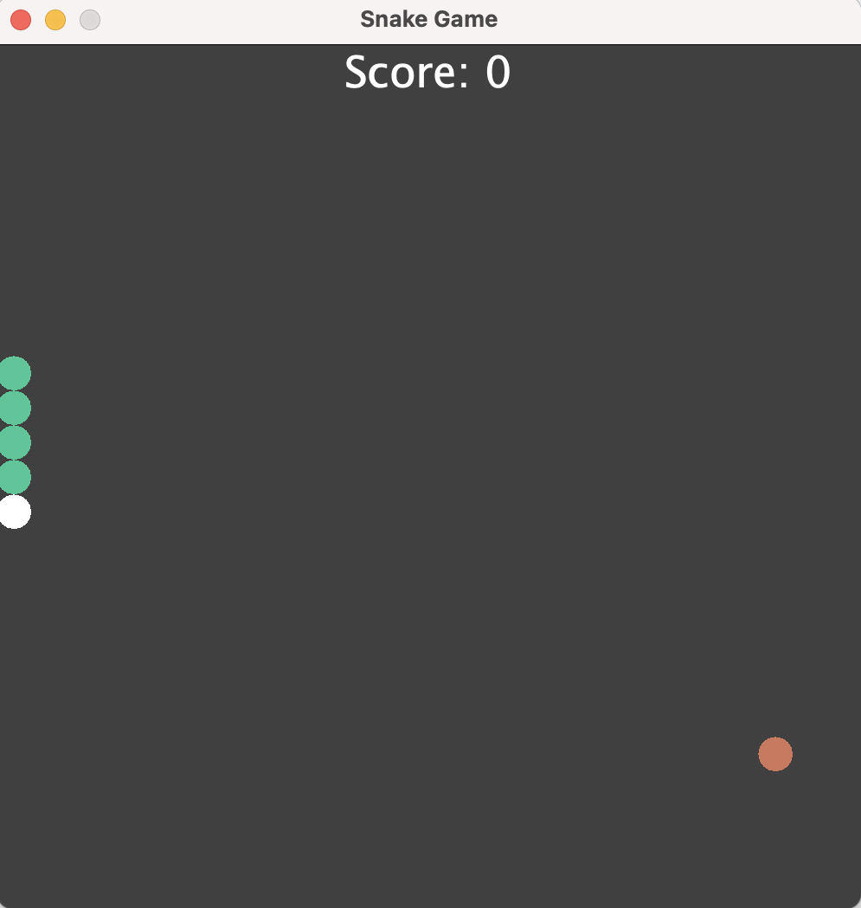
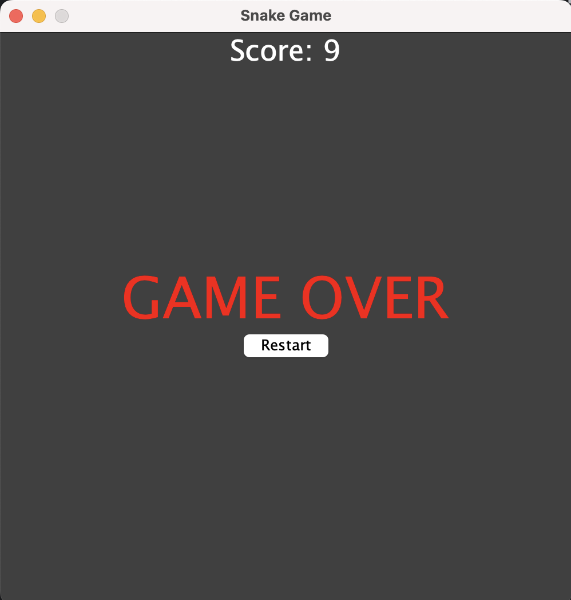

# Snake Game

A simple Snake game implemented in Java using Swing for the GUI.

## Table of Contents

-   [Introduction](#introduction)
-   [Features](#features)
-   [Installation](#installation)
-   [How to Play](#how-to-play)
-   [Controls](#controls)
-   [Screenshots](#screenshots)
-   [Contributing](#contributing)
-   [License](#license)

## Introduction

This project is a classic Snake game implementation written in Java. It provides a graphical interface using Java Swing for the game display and user interaction.

## Features

-   Snake movement and control
-   Food generation and consumption
-   Score tracking
-   Game over detection
-   Restart functionality

## Installation

To play the game, you'll need to have Java installed on your system. You can run the game using the provided JAR file or compile the source code yourself.

1. Download the `snake-game.jar` file from the repository.
2. Double-click the JAR file to run the game.

## How to Play

Really? Who doesn't know how to play Snake Game

-   The snake moves in the direction of the arrow keys.
-   The game ends when the snake collides with the wall or itself.

## Controls

-   Use the arrow keys (up, down, left, right) to control the snake's movement.
-   Press the "Restart" button to restart the game after it ends.

## Screenshots

    
     
    

## Contributing

Contributions to the project are welcome! If you'd like to contribute, please fork the repository and submit a pull request with your changes.

## License

This project is licensed under the [MIT License](LICENSE).
